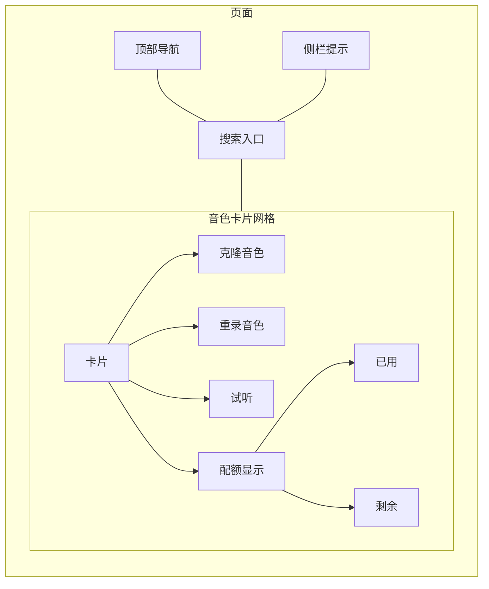
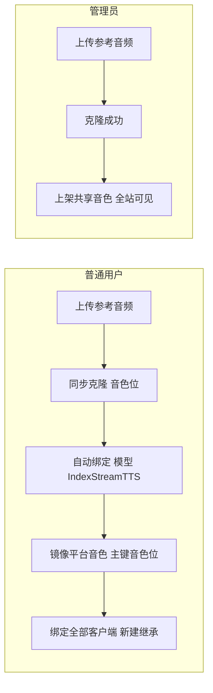
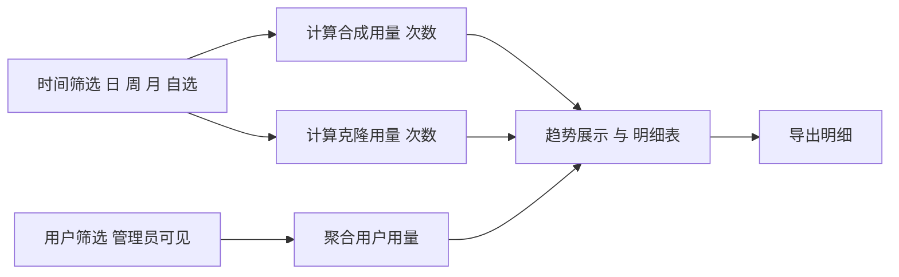
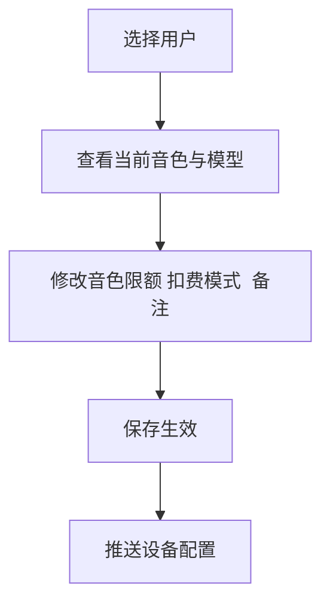

# 前端界面 Mermaid 草图与流程 一页式

目标
- 覆盖三页 克隆音色 我的用量 音色分配
- 节点文本安全 无括号 无斜杠 无点号 仅简洁中文
- 直观展示页面结构与核心流程 单人可落地

---

## 克隆音色界面 普通用户 管理员

页面骨架

流程图

交互要点
- 音色卡片支持克隆 替换 删除 操作
- 替换会更新音色位 并同步到平台音色镜像
- 私有音色卡片仅本人可见 共享音色所有人可见 卡片界面仅显示私有音色卡片 管理员界面显示共享音色卡片

---

## 我的用量界面 普通用户 管理员

流程图

行为与权限
- 普通用户 仅查看本人用量 支持时间筛选 导出
- 管理员 可切换任意用户或全部用户 查看聚合
- 指标分克隆与合成 两类各有次数 时长 成本

---

## 音色分配界面 管理员 table界面

流程图

规则与校验
- 只有管理员可访问本页
- 限额为自然数 支持清零与上限
- 保存后立刻生效 并对新建客户端同样生效

---

里程碑与联动
- 克隆音色页 完成私有与共享音色的创建与绑定
- 我的用量页 提供克隆与合成的可视化用量
- 音色分配页 提供管理员对用户音色与限额的集中管理
