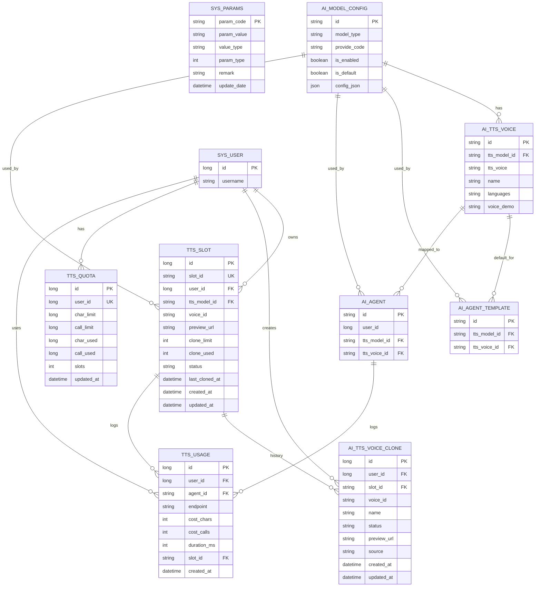

# 小智 IndexTTS 数据实体关系图（Mermaid）

> 说明：本图覆盖复用表与新增表，并标注主要外键与权限。节点与关系名使用安全文本。

- 权限与使用
  - 共享音色 AI_TTS_VOICE：仅管理员可新增编辑删除；全体可读使用（按模型筛选）。
  - 音色位 TTS_SLOT：管理员分配给用户；用户基于 slot 克隆与替换绑定 voice_id。
  - 克隆历史 AI_TTS_VOICE_CLONE：记录每次克隆结果与预览，便于审计与回溯。
  - 配额与用量 TTS_QUOTA 与 TTS_USAGE：采用两表方案；合成与克隆写入 usage，对账聚合于看板。
  - 平台参数 SYS_PARAMS：配置 indextts.base_url 与 indextts.api_key，仅管理员可写。

