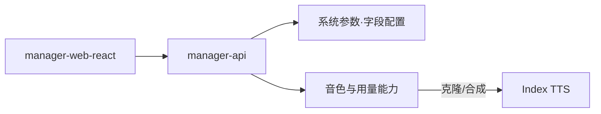
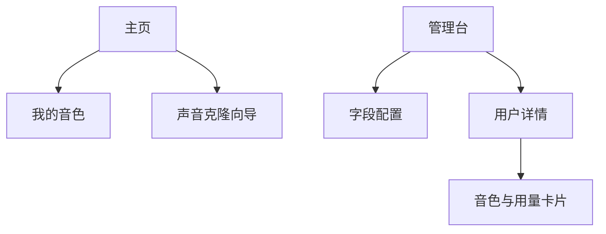
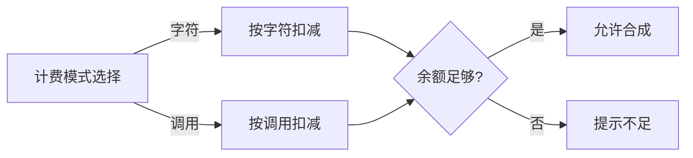
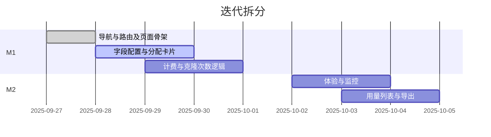

# 小智声音克隆（Index TTS 接入）开发文档

  

## 一、当前架构识别（与本需求相关）

-   管理端前台：`main/manager-web-react/`（React + Vite）
    -   导航与路由：`src/App.tsx`、`src/components/layout/Sidebar.tsx`
    -   API 与 Hook：`src/api/**`、`src/hooks/**`
-   管理后台（后端）：`main/manager-api/`（Spring Boot）
    -   系统参数（字段配置）：`xiaozhi.modules.sys` 模块（如 `SysParamsDTO.java`）
    -   业务扩展建议：新增 `xiaozhi.modules.voice` 包（控制器/服务/用量记录）
-   实时引擎（Python）：`main/xiaozhi-server/`（本期不直接改造）

## 二、需要新增的页面（前台）

1.  我的音色（用户）
    -   路由：`/my-voices`
    -   建议：`src/pages/voices/MyVoices.tsx`
    -   作用：展示名称/状态/最近时间/剩余克隆次数；预听、设默认、编辑（再次克隆）。
2.  声音克隆向导（用户）
    -   路由：`/voice-clone`
    -   建议：`src/pages/voices/CloneWizard.tsx`
    -   作用：录音或上传（≥12 秒）、参考文本、提交与完成反馈。
3.  用户音色分配卡片（管理员）
    -   入口：用户详情页
    -   建议：`src/pages/users/UserDetail/VoiceAssignCard.tsx`
    -   作用：创建槽位、设置重复克隆上限、选择计费模式（字符/调用二选一）与对应配额、启用/禁用。
4.  字段配置补充项（管理员）
    -   复用现有“字段配置”页面
    -   作用：新增“Index TTS 密钥”“Index TTS 接入地址（可选）”的可见名称与说明文案。

## 三、需要改动的功能及其位置（不写实现细节）

-   导航与路由
    -   `main/manager-web-react/src/components/layout/Sidebar.tsx`：新增“我的音色”菜单（按权限显示）。
    -   `main/manager-web-react/src/App.tsx`：注册 `/my-voices`、`/voice-clone` 路由。
-   字段配置（管理员）
    -   在既有字段配置页面新增两项配置的展示与说明文案（密钥与接入地址）。
-   用户详情页（管理员）
    -   增加“音色与用量”卡片：创建/编辑槽位；设置重复克隆上限；选择计费模式并填配额；启用/禁用。
-   合成入口的音色选择（用户/设备关联界面）
    -   现有音色下拉若为硬编码，改为“按用户槽位动态加载最近一次成功克隆的音色”。

## 四、需要调整的逻辑（跨端一致性）

-   计费模式互斥（二选一）
    -   管理员在用户/槽位层面选择“字符计费”或“调用计费”。
    -   合成时据此扣减“字符数”或“调用次数”；余额不足给出对应提示；模式切换不回溯历史记录。
-   克隆次数管理
    -   再次克隆成功后剩余次数-1；次数用尽后禁用再次克隆，但仍可使用最近一次成功的音色进行合成。
-   资源可见性
    -   用户仅能看到/使用自己被分配的槽位音色；管理员可查看与调整任意用户的分配与用量。
-   字段配置读取
    -   密钥与接入地址来自“字段配置”；前台不展示密钥原文，仅展示用途说明与生效提示。

## 六、交互与文案边界

-   录音/上传不足 12 秒：阻断提交并提示；
-   次数/配额不足：
    -   字符计费不足：提示减少文本或联系管理员补充配额；
    -   调用计费用尽：提示联系管理员增加调用次数；
-   克隆成功：提供返回“我的音色”的快捷按钮与预听说明。

## 七、迭代拆分与交付物

-   M1 最小可用
    -   页面：我的音色 + 克隆向导（可先上线其一）+ 导航/路由接入；
    -   管理：字段配置项 + 用户“音色与用量”卡片（基本表单）；
    -   逻辑：互斥计费模式、克隆次数扣减、音色可见性；
-   M2 体验完善
    -   页面：预听、设默认、失败重试与提示优化；
    -   管理：用量列表与汇总的筛选/导出；
    -   规范：错误提示统一、埋点与最小监控面板。

