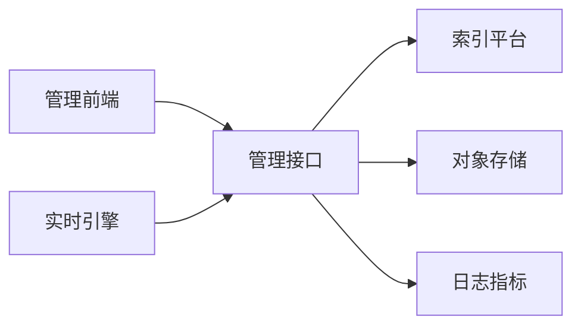
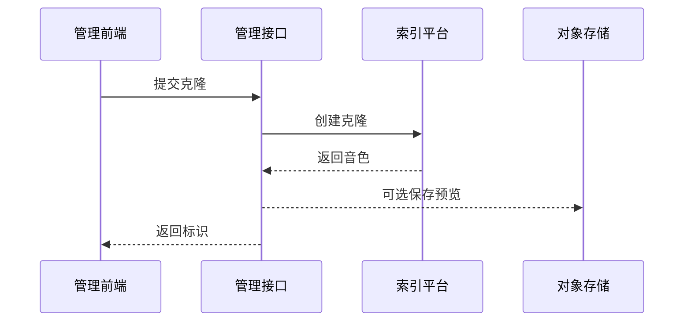
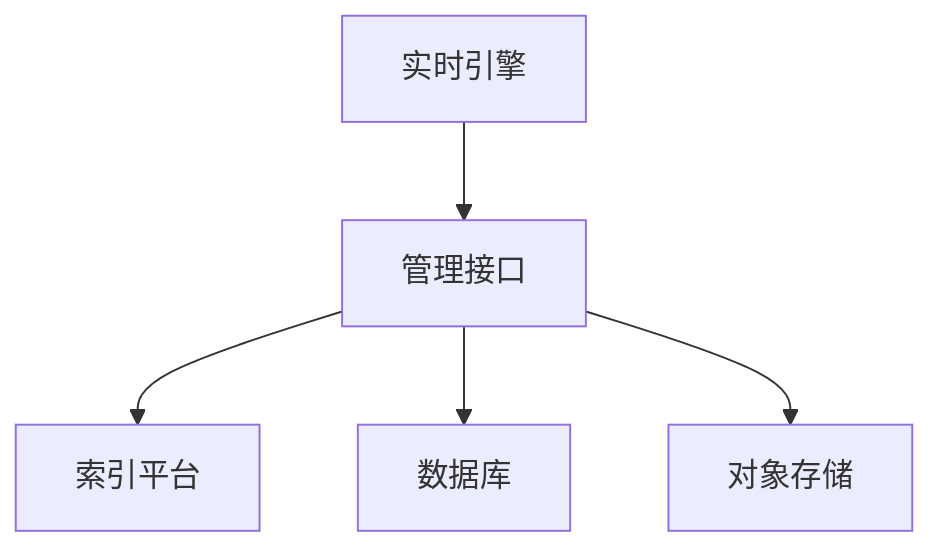

## ManagerAPI 端技术方案 4R 与 5W2H 精简版

单人团队最小闭环 以能实现需求为主 管理接口只做声音克隆与管理 角色到音色配置 配额与用量 管理台合成仅测试用 实时引擎是否使用索引平台由服务端本地配置决定

### 4R 框架

#### Reason 原因
- 统一声音资产管理与角色映射 实时引擎只读配置不承担管理
- 索引平台克隆为同步接口 无需任务轮询 降低实现复杂度
- 保持 Provider 开关在服务端本地配置 管理接口不介入运行时选择
- 单人团队限制 以最小功能闭环交付 可快速验收

-#### Result 结果
- 交付物
  - 数据表 复用 ai_agent 与 ai_agent_template 存储 tts_model_id 与 tts_voice_id 复用 ai_tts_voice 作为共享音色 如需用户克隆 仅新增 ai_tts_voice_clone 不引入角色新表 配额与开关复用 sys_params 用量沿用聊天记录
  - 接口 声音克隆 角色配置读取与更新 共享音色查询 配额设置与读取 用量上报或按聊天记录统计 合成测试
  - 适配器 封装索引平台客户端 统一超时与错误映射
  - OpenAPI 文档与前端客户端生成
- 验收口径
  - 可创建克隆 获得音色标识 可选预览
  - 实时引擎能按角色拿到 voiceId 并完成合成
  - 配额准确扣减 错误码一致 可观测性具备

#### Roadmap 路线
1 数据库变更 最小化 如需仅新增 ai_tts_voice_clone 表 其余复用现有表
2 管理配置页录入索引平台地址与密钥 后端读取环境变量或配置表
3 开发索引平台客户端 统一超时重试与错误码
4 实现接口 克隆 角色配置 共享音色 配额 用量 合成测试
5 加入指标与日志 p95耗时 成功率 限流次数 关键字段脱敏
6 更新 OpenAPI 生成前端客户端 用管理台测试页完成端到端验证

#### Risks 风险
- 平台变化 导致响应不兼容 通过适配层集中映射并加契约测试降低影响
- 配额误扣或并发写入冲突 通过受理即预扣 失败回滚 乐观锁或去重键
- 密钥泄漏 风险 仅服务端保存 不返回到前端 审计操作日志
- 请求超时与限流 采用重试与退避 并暴露限流指标 允许回退默认音色

### 5W2H 框架

#### What 做什麼
- 声音克隆与管理 支持共享音色与个人音色
- 角色到音色配置 实时引擎查询 voiceId 与模型参数
- 配额与用量 记录字符或调用扣减
- 合成测试 仅管理台同步返回音频或链接

#### Why 為什麼
- 集中管理声音资产与配额 降低运行时复杂度
- 与实时引擎解耦 通过只读配置对接 便于替换 Provider
- 索引平台提供同步克隆与合成 流程简单 成本可控

#### Who 誰來做與用
- 责任主体 管理接口团队 单人实现
- 使用者 管理员 普通用户 实时引擎
- 外部方 索引平台 对象存储

#### Where 在哪裡
- 组件 管理接口 服务端数据库 对象存储 索引平台
- 数据落点 声音 角色配置 配额 用量 记录在数据库 预览可存对象存储

#### When 何時
- D1 到 D2 数据库变更 与 平台客户端
- D3 到 D4 接口实现 与 前端对接
- D5 验收联调 与 指标校验

#### How 怎麼做
- 数据模型 精简
  - 共享音色 复用表 ai_tts_voice 按模型查询
  - 克隆音色 新增表 ai_tts_voice_clone 字段 id userId voiceId name status previewUrl source createdAt updatedAt
  - 角色配置 复用表 ai_agent 与 ai_agent_template 使用字段 ttsModelId ttsVoiceId 存储映射 不新增角色相关表
  - 配额与开关 复用表 sys_params 以参数编码管理全局或分用户阈值
  - 用量统计 复用表 ai_agent_chat_history 以文本长度与调用次数聚合
- 接口 统一返回 code message data requestId
  - POST api tts voice clone 入参 slotId name fileUrls 返回 voiceId 与预览 结果写入 ai_tts_voice_clone
  - PUT agent 使用 AgentUpdateDTO 更新 ttsModelId 与 ttsVoiceId GET agent id 获取详情 角色映射不设新表
  - GET models modelId voices 查询共享音色 列表来源 ai_tts_voice
  - GET POST admin params 设置与读取配额与阈值 仅管理员
  - POST api tts usage 上报用量 或按 ai_agent_chat_history 离线统计
  - POST api tts speak 管理台合成测试 同步返回音频
  - 引擎配置获取 POST config agent-models 供实时引擎读取角色到模型与音色映射
- 配额与限流
  - 字符或调用两种计费 二选一即可
  - 预扣模式 失败回滚 记录原因 指标可观测
- 错误码
  - 未授权 速率超限 配额不足 音频不合规 平台异常 超时
- 平台适配
  - 克隆接口 voices clone 入参上传地址列表 返回音色标识与统计
  - 合成接口 tts 入参文本与音色标识 返回音频
- 配置与安全
  - 环境或配置表 存储平台地址与密钥 前端仅写入不读回

### 验收清单
- 能创建克隆并查看预览 共享音色可用
- 实时引擎读取角色配置 正常合成
- 配额准确扣减 错误码清晰 指标可观测
