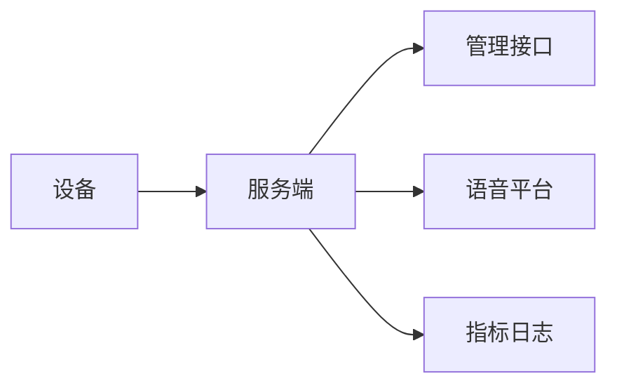
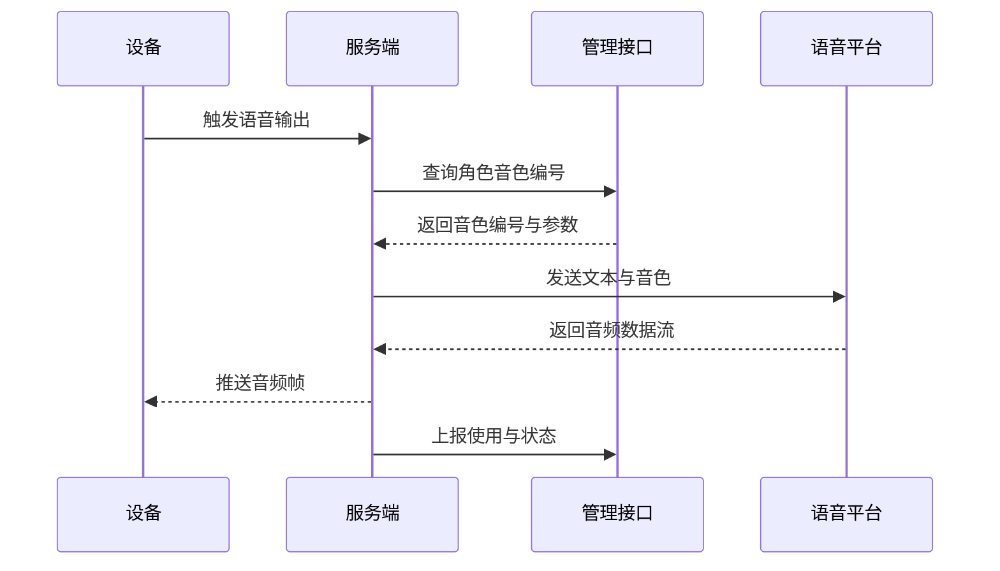

## Server 端方案 IndexTTS 接入 4R 与 5W2H 精简版

目标 清晰落地 面向单人团队 复用现有 TTS 抽象 仅以配置切换 Provider 完成运行时合成与播放 不新增通道与路由



### 4R 框架

1 Reason 动机与边界
- 运行时合成交付在服务端 需要对接语音平台 完成克隆音色播放
- 约束 不改播发管线 不新建通道 以最低改造完成接入
- 非目标 管理接口不承担运行时合成 设备不保存密钥

2 Result 结果与验收
- 启用 IndexTTS Provider 后 设备能流式播放克隆音色
- 切换回其他 Provider 仅改 selected module 无代码改动
- 指标可见 成功率 首帧延迟 重试次数 合成时长
- 验收 试运行十段文本 零崩溃 首帧小于两秒 成功率大于九十五

3 Roadmap 路线与步骤
- 新 Provider 校验 已有 IndexStreamTTS 代码走通
- 本地配置启用 selected module 与语音平台地址
- 运行时读取 voiceId 并调用语音平台 合成推送
- 上报使用与失败 封装于既有管线

4 Risks 风险与对策
- 合成抖动 对策 指数退避三次 并回退默认音色
- 首帧过慢 对策 首句优先分段 与缓存热身
- 配置缺失 对策 读取管理接口 voiceId 失败时使用默认音色
- 依赖中断 对策 读超时十秒 写超时十秒 并降级



### 5W2H 精简版

- What 做什么
  - 接入语音平台 复用 Provider 抽象 以配置切换 IndexStreamTTS 完成合成播放闭环

- Why 为什么
  - 快速提供克隆音色体验 降低改造成本 维持既有管线稳定性

- Who 谁负责
  - 服务端一人负责配置与验证 管理接口提供 voiceId 查询与密钥存储 语音平台提供合成能力

- Where 在哪里改
  - 代码位置 main xiaozhi server core providers tts index_stream py
  - 装配位置 main xiaozhi server core utils modules_initialize py
  - 配置位置 main xiaozhi server config config yaml 与 data config yaml 覆盖

- When 何时完成
  - 当日完成配置与本地压测 次日联调管理接口 与设备端听测

- How 怎么做
  - 仅改配置 不动通道 运行时按角色查询 voiceId 调用语音平台合成 并通过现有帧管线推送到设备


### 配置与启用

示例 server 端配置片段

```
selected_module:
  TTS: IndexStreamTTS
TTS:
  IndexStreamTTS:
    type: index_stream
    api_url: http://内网地址或代理端口/tts
    api_key: ${INDEXTTS_KEY}
    tts_timeout: 10
    audio_format: pcm
```

关键说明
- 音色编号从管理接口查询 并在运行时传入 Provider 合成
- 失败三次后回退默认音色 不中断通路
- 密钥仅存于服务端或管理接口 不向设备下发

### 指标与日志
- 指标 成功率 首帧延迟 重试次数 合成时长 与设备覆盖率
- 日志 设备标识 文本长度 音色编号 错误摘要 与合成耗时

### 验收清单
- 十段文本 各一百字以上 首帧小于两秒 成功率大于九十五
- 切换 Provider 前后对比日志无新增错误 与通道无变化
- 断开语音平台后回退默认音色 设备播放不中断

### 回滚策略
- 仅切换 selected module 回到原 Provider 配置文件内完成回滚 无需改代码
