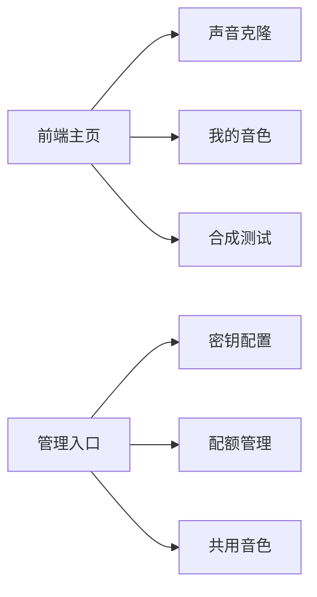
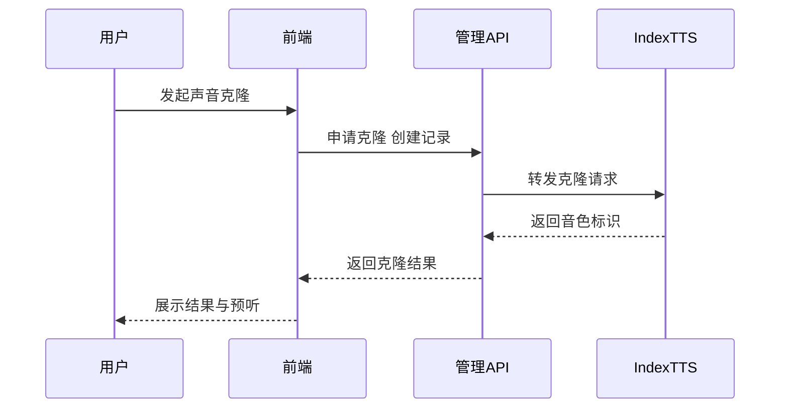
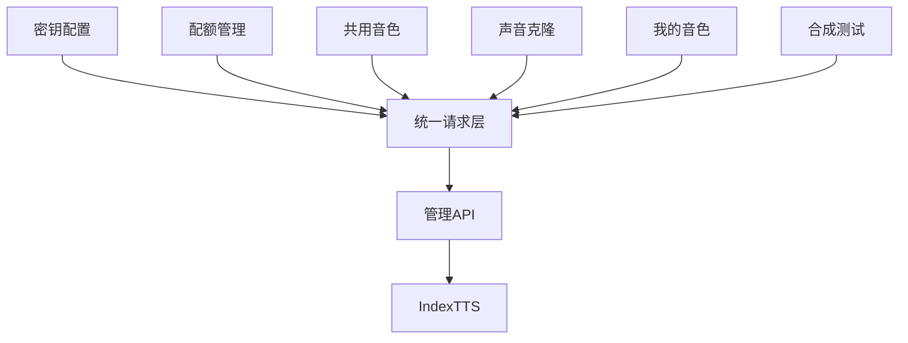

## 管理前端 React 端技术方案 精简版 4R 与 5W2H

面向单人团队的最小交付。复用现有页面加少量新增页即可闭环。全文件小于三百行并配合安全 mermaid 图。

**4R Reason**
- 需要在管理台完成 IndexTTS 接入链路的可视化操作 与最小配置。
- 降低服务端配置复杂度 让管理员录入密钥与地址 并管理音色与配额。
- 为用户提供克隆向导 我的音色 与合成测试 形成自助闭环。

**4R Result**
- 管理端可完成 IndexTTS 基址与密钥配置 并可管理配额与共用音色。
- 用户可自助克隆管理并测试合成 与后端字段完全对齐。
- 页面与接口最少化 不新增复杂路由或跨端依赖。
- 验收通过标准见下文 统一提示文案与错误处理。

**4R Roadmap**
- 第一日 路由与菜单接入 新增字段与权限守卫。
- 第二日 三页表单与列表实现 含基础校验与提示。
- 第三日 接口联调 合成测试音频播放与异常处理。
- 第四日 验收用例过一遍 文案与残缺角落修补。

**4R Risks**
- 平台不可用 或接口限频 高风险 采用重试与熔断提示稍后再试。
- 音频兼容问题 中风险 统一使用 wav 与浏览器原生解码。
- 配额模型不一致 低风险 以后端为准 前端仅展示与输入。
- 文档与字段对不齐 低风险 以 OpenAPI 生成或单点封装对齐。

---

**5W2H What**
- 服务端配置页 增加 IndexTTS 基址与密钥字段 管理员可见。
- 管理侧两页 配额管理 共用音色 维护 voiceId 映射与可见性。
- 用户侧三页 声音克隆向导 我的音色 合成测试。
- 统一轻量组件 录音 上传 播放 提示 分页。

**5W2H Why**
- 单人团队最小闭环 以能实现需求为主 避免大改造。
- 把运行时合成工作交给服务端与 IndexTTS 管理台只做配置与自助工具。

**5W2H Who**
- 管理员 负责密钥与地址 配额与共用音色。
- 普通用户 负责克隆与自测 仅可见本人数据。
- 开发者 一人承担路由 UI 与接口联调 以复用为先。

**5W2H Where**
- 代码位置 `main/manager-web-react` 路由与页面在 `src/pages` 组件在 `src/components`。
- 接口客户端 采用 `npm run generate:openapi` 或 `src/services/http.ts` 轻封装。
- 路由建议
  - 管理入口 `/admin/tts-config` `/admin/tts-quotas` `/admin/shared-voices`
  - 用户入口 `/voice-clone` `/my-voices` `/tts-test`

**5W2H When**
- 一到四日 完成与联调 验收上线 可并行做文案与样式微调。

**5W2H How**
- 鉴权与可见性 基于现有角色守卫 管理入口只对管理员显示。
- 表单校验 时长必须不少于十二秒 文件格式与大小限制 失败明确提示。
- 音频播放 使用原生 audio 元素 支持暂停与重播。
- 错误处理 对网络 错误码与限频分开提示 友好降级。
- 生成客户端 优先 OpenAPI 生成 退化到 axios 轻封装 一个方法一个文件。

---

验收标准与用例
- 配置保存 生效可读 仅管理员可见。
- 克隆向导 完成录制或上传 预听 提交 成功后可在我的音色看到并预听。
- 合成测试 选择音色 输入文本 能播放音频 错误有提示。
- 配额与共用音色 管理与展示正常 字段与后端一致。

异常与文案约定
- 时长不足 提示录制时间不够 请继续录制。
- 上传失败 提示网络异常 请稍后再试。
- 达到上限 提示配额不足 请联系管理员。

实施与回滚
- 采用特性开关 隐藏管理入口 无需回滚数据库。
- 前端可灰度上线 与后端接口兼容时再放开菜单。
