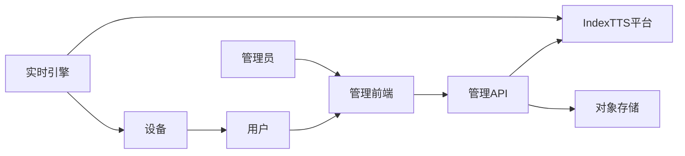
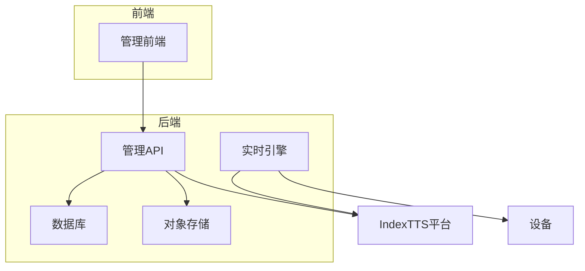
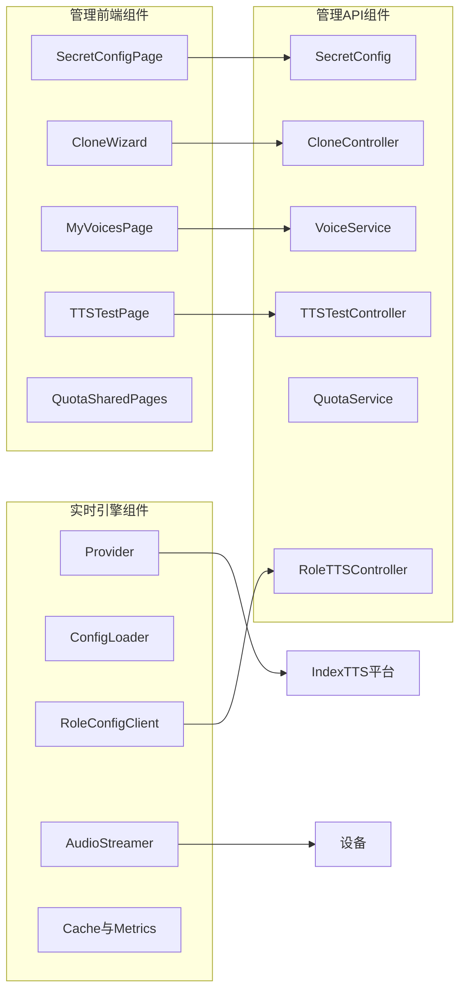
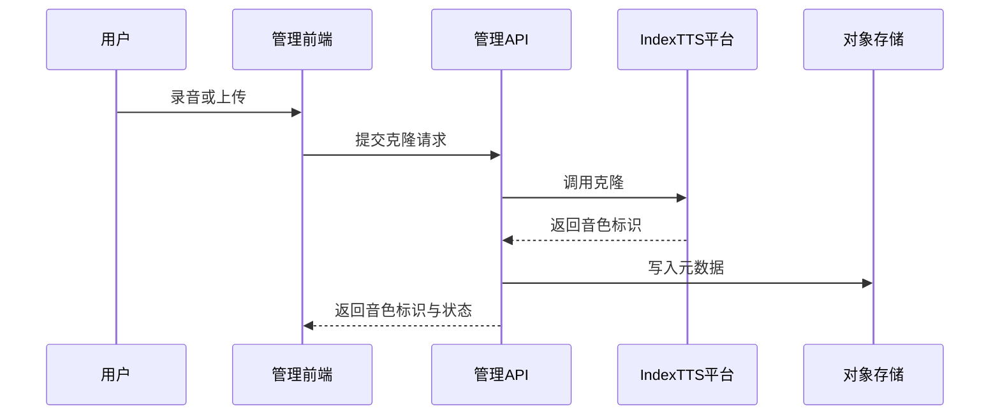
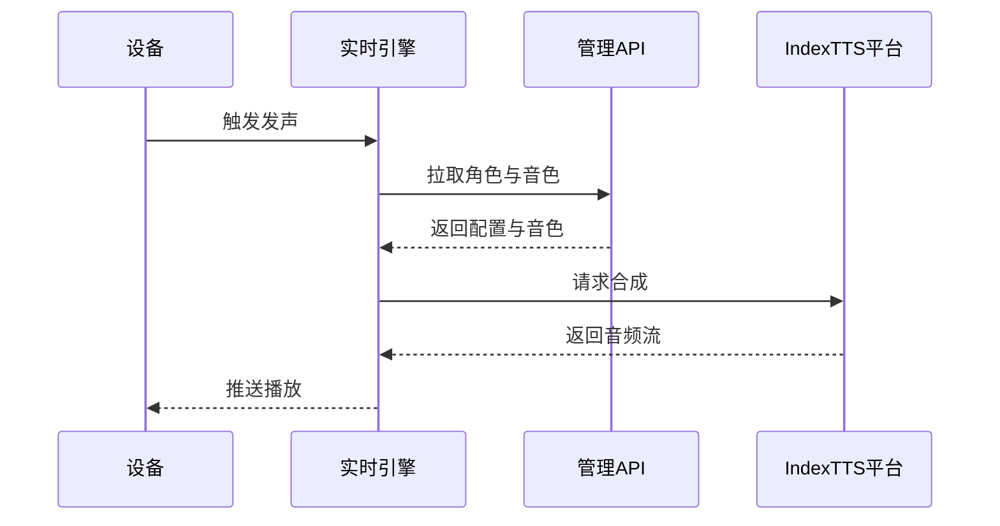

## 小智 IndexTTS 技术方案 C4 加 4R

导读：本方案采用 C4 模型描述系统上下文与容器与组件与运行时交互，并用 4R 归纳背景目标路径风险。为便于阅读，mermaid 节点使用纯文本。

— C4 模型 —

### C1 系统上下文 System Context
目标系统是小智语音能力域 包含实时引擎 管理API 管理前端 对接 IndexTTS 与对象存储 并服务终端设备与管理员用户。

### C2 容器图 Containers
- 实时引擎 容器 Python 服务 负责运行时合成与推流 通过 Provider IndexStreamTTS 直连 IndexTTS。
- 管理 API 容器 Java Spring 服务 负责声音克隆 音色管理 角色映射 配额用量 合成测试 OpenAPI。
- 管理前端 容器 React Vite 应用 负责密钥配置 克隆向导 我的音色 合成测试。
- 数据容器 数据库 与 对象存储 用于保存音色元数据 合成记录 以及音频文件。
- 外部容器 IndexTTS 平台 提供克隆与合成。

### C3 组件图 Components
- 实时引擎 主要组件
  - Provider IndexStreamTTS 直连 IndexTTS 合成 输出音频流或分片
  - Config Loader 安全读取基础地址与密钥 支持本地与远端配置
  - Role Config Client 从管理API 拉取角色到音色映射
  - Audio Streamer 推送到设备 支持断点与分片
  - Cache 与 Metrics 热点缓存与指标日志
- 管理 API 主要组件
  - Voice Clone Controller 提交上传或录音 代理 IndexTTS 克隆
  - Voice Service 音色元数据管理 默认音色与预听
  - Role TTS Controller 运行时查询 roleId 到 voiceId 与参数
  - TTS Test Controller 面向前端测试页 的合成代调用
  - Quota Service 与 Billing 限额与扣减 统计用量
  - Secret Config Service 安全管理基础地址与密钥
- 管理前端 主要组件
  - Secret Config Page 管理 IndexTTS 基础地址与密钥
  - Voice Clone Wizard 录音上传 校验 预听 提交
  - My Voices Page 列表 状态 预听 设默认 再次克隆
  - TTS Test Page 选择音色 输入文本 试听 历史
  - Quota And Shared Voices Pages 配额与共用音色管理

### C4 运行时与接口 Runtime Views
运行时合成链路与克隆链路如下。

克隆链路

运行时合成链路

— 4R 框架 —

### R1 Reason 背景与动因
- 用户诉求 个性音色与更高拟真度 需要声音克隆与实时合成。
- 环境约束 实时引擎负责运行时合成 支持 Provider 机制 管理API 做配置与克隆与用量 管理前端仅测试合成。
- 平台特性 IndexTTS 同步克隆 同步合成 适合实时链路直连。
- 共识 不增新通道 复用 Provider Server 以本地配置启用 IndexStreamTTS 密钥不下发到设备与前端。

### R2 Result 目标与产出
- 业务目标 运行时合成可用并可播放 失败回退默认音色 管理台可克隆 管理音色 测试合成 配额可控。
- 技术产出 实时引擎具备直连合成 缓存 指标日志 管理API具备克隆 角色映射 用量与测试 前端具备密钥配置 克隆向导 我的音色 合成测试。
- 验收口径 成功率 时延p95 缓存命中率 用量扣减准确 接口稳定。

### R3 Roadmap 实施路径
- M1 最小可用 一周 克隆与运行时合成打通 前端三页雏形 密钥配置。
- M2 体验提升 一到两周 缓存 限流 指标日志 配额与共用音色最小版。
- M3 联调稳定 一周 设备联调 异常兜底与提示 时延与重试优化。

### R4 Risks 风险与应对
- 平台不可用或超时 设置十秒平台超时 三次指数退避 失败回退默认音色 并记录日志。
- 用量与成本 风险 字符或调用限额 预占或后扣策略 明确限流提示。
- 供应商锁定 通过 Provider 抽象保留替换空间 默认音色可跨 Provider。
- 时延波动 启用缓存 分片推流 监控 p95 并报警。
- 素材质量 前端校验与提示 失败原因可见 支持再次克隆。
- 密钥安全 密钥仅在管理端或服务端存放 API 权限校验与审计。

— 接口 契约与配置 —

### 最小接口集合
- 管理 API 对前端
  - POST api tts voice clone 入参 slotId name file 或 fileUrl 出参 voiceId status previewUrl
  - GET api tts voice item 入参 voiceId 出参 voiceId name status previewUrl
  - GET POST api tts quotas 配额查询与设置
  - GET POST api tts shared 共用音色列表与变更
- 管理 API 对实时引擎
  - GET api roles tts config 入参 roleId 出参 Provider 名称 参数 voiceId
- 实时引擎对设备或上游
  - WebSocket ws device 消息含 action tts roleId text
  - HTTP POST rt tts speak 字段 roleId text 可选 speed format 响应音频流或分片地址
- 错误码 RATE_LIMITED INSUFFICIENT_QUOTA INVALID_AUDIO PLATFORM_ERROR TIMEOUT UNAUTHORIZED

### 配置与安全
- 环境变量 INDEX_TTS_API_KEY INDEX_TTS_BASE_URL STORAGE_BASE_PATH PUBLIC_BASE_URL RATE_LIMIT_RPS TIMEOUT_MS
- Server 启用 本地配置 selected_module.TTS 等于 IndexStreamTTS 不依赖远端切换
- 密钥不下发到设备与前端 仅服务端或管理端可读

— 数据 存储与观测 —

### 数据模型与落地
- 音色元数据 用户标识 名字 状态 预听地址 来源 时间戳
- 合成记录 文本哈希 时长 音频地址 耗时 计费字段 状态 时间戳
- 可选音频落地路径 tts 日期 音色 文本哈希 格式 热点缓存三天

### 指标与日志
- 指标 成功率 时延p50 p95 重试次数 限流次数 缓存命中率 用量统计
- 日志 结构化记录 请求标识 音色标识 文本长度 错误摘要
