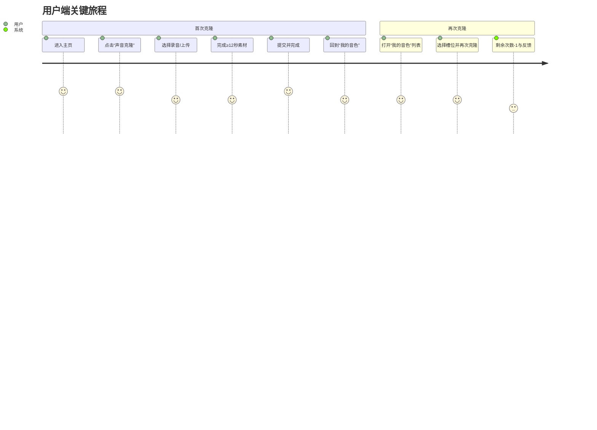
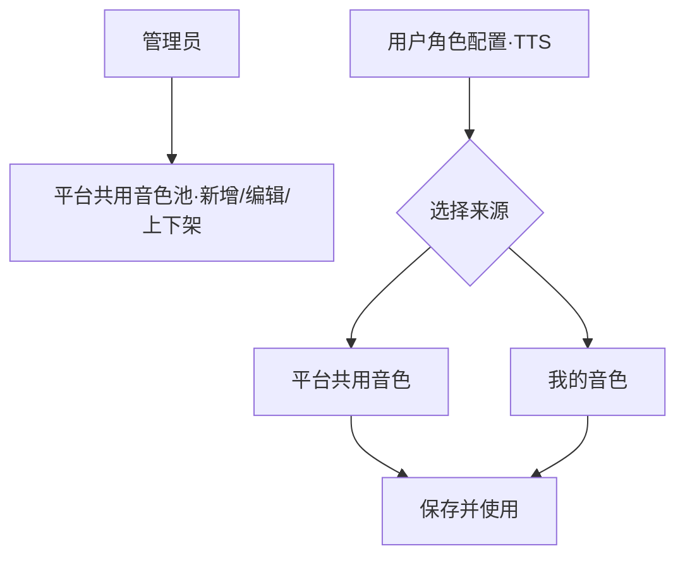
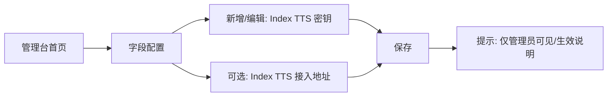
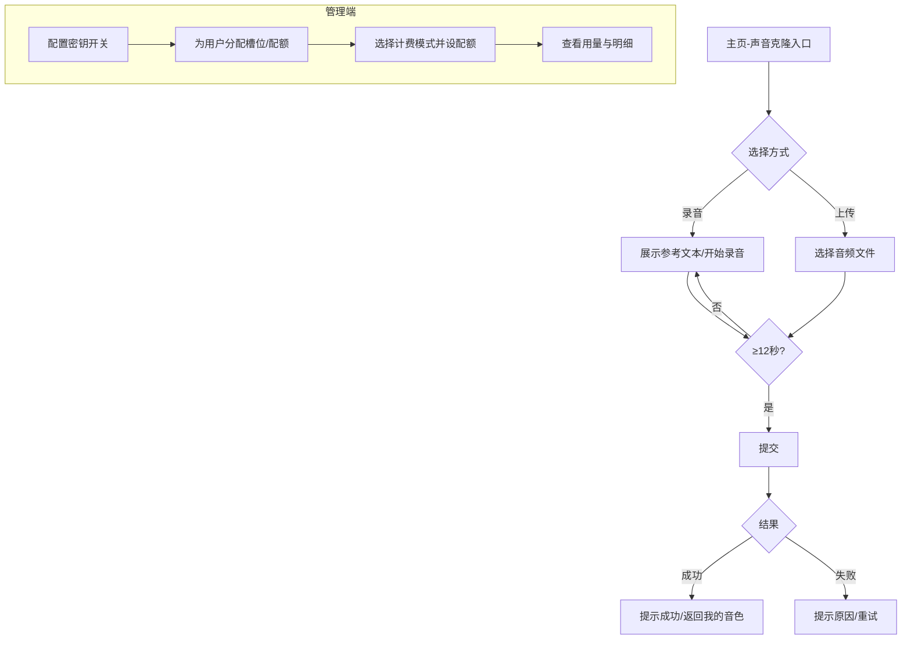
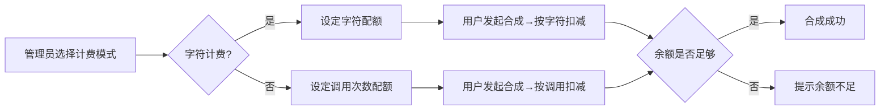
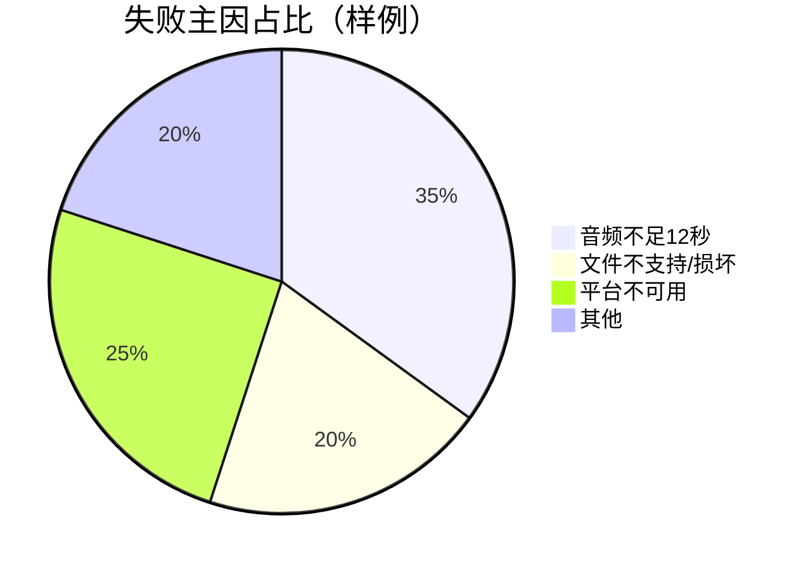
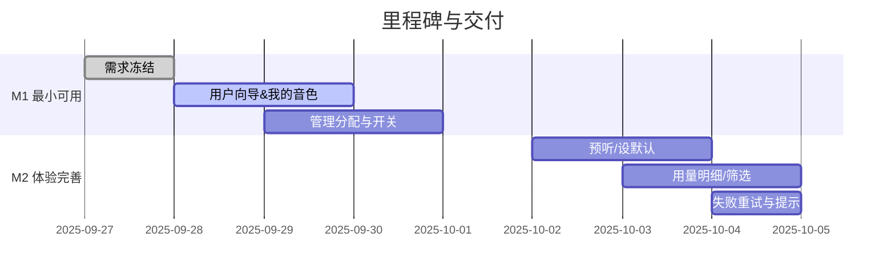
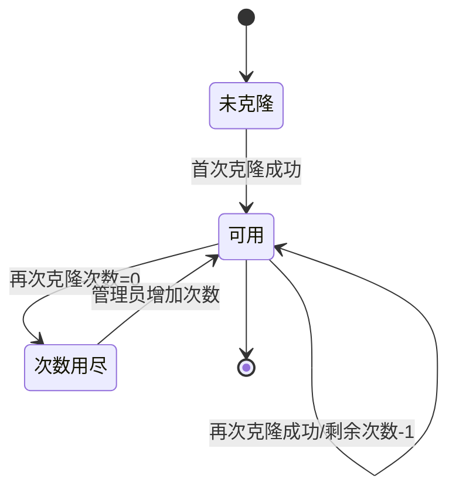
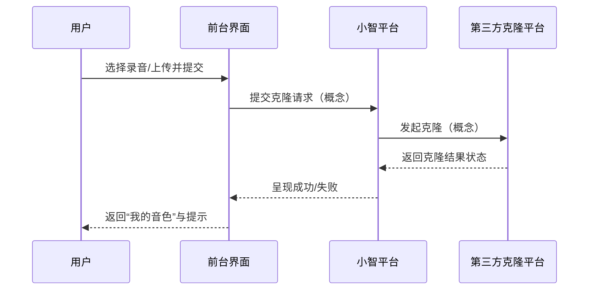
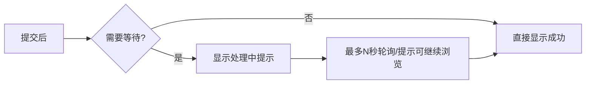

# 小智声音克隆（Index TTS 接入）产品需求文档（PRD）

本文件仅阐述产品视角的目标、范围、规则、流程与验收，不包含任何技术实现细节（如 API、数据表、代码模块）。

## 0. 本次版本范围（一句话）
- 新增并启用 IndexTTS Provider（由 Server 本地配置开启），用户可用克隆音色完成合成与播放；ManagerAPI 负责克隆与 voiceId 管理、配额与用量；前端仅补录入与选择项；用量沿用现有上报。

## 1. 背景
- 用户希望在小智平台内完成“声音克隆”，并能在 TTS 合成中使用自己的音色。
- 管理员需在后台对用户的音色和 TTS 用量进行分配与管理（按字符计费）。

## 2. 目标
- 用户端
  - 在主页进入“声音克隆”，通过“录音”或“上传音频”（≥12 秒）完成克隆。
  - 在“我的音色”查看克隆结果，支持再次克隆（受次数限制）、预听、设为默认使用音色。
- 管理端
  - 配置第三方平台接入所需的密钥。
  - 为用户分配音色槽位、重复克隆上限、TTS 字符用量；查看用量与明细。
- 平台体验
  - 提供清晰的向导流程与状态反馈；错误提示明确可理解。

## 3. 角色与权限
- 管理员：配置密钥；为用户分配/调整音色槽位、重复克隆上限、TTS 用量；查看用量与明细。
- 用户：发起声音克隆；管理“我的音色”；在 TTS 使用中选择自己的音色。
// 补充：平台共用音色
- 管理员：可创建/维护“平台共用音色”，供符合条件的用户在角色配置中选择使用。
- 用户：在“角色配置”的 TTS 选项中，可选择“平台共用音色”或“我的音色”。

## 4. 核心概念
- 音色槽位：管理员给用户的音色占位与命名空间，可被用户用于克隆生成具体音色。
- 重复克隆次数：用户在该槽位上可重新克隆/替换音色的次数上限；每次再次克隆消耗 1 次。
- 计费模式（互斥二选一）：由管理员为用户（或槽位）选择其一。
  - TTS 字符用量：按输入文本的字符数扣减配额；克隆不消耗该配额。
  - TTS 调用次数：每发起一次合成扣减 1 次；克隆不消耗该配额。
- 平台共用音色池：由管理员统一克隆与维护的音色集合；满足模型兼容性与权限策略的用户可直接选择使用。

## 5. 范围和不做
- 范围
  - 声音克隆向导（录音/上传、校验、提交、完成反馈）。
  - “我的音色”管理（列表、状态、剩余次数、预听、设默认、编辑）。
  - 管理台配置密钥、分配音色槽位与配额、查看用量。
- 暂不做
  - 多人审批、批量导入导出、跨组织结算、复杂可视化大盘、第三方计费对账。

## 6. 用户场景
- 首次克隆：用户进入主页 → 声音克隆 → 选择录音或上传（≥12 秒）→ 提交 → 回到我的音色看到“克隆成功”，可预听和设为默认。
- 再次克隆：用户在“我的音色”中对指定槽位发起再次克隆，剩余次数扣减 1；若次数用尽，提示联系管理员。
- 用量不足：用户在合成时若字符用量不足，给出明确提示和指引（联系管理员或减少文案）。
- 选择平台共用音色：用户在“角色配置”的 TTS 设置中，从“平台共用音色”列表选择可用音色，保存后按当前计费模式产生消耗。

## 7. 操作流程（产品层）
- 用户端
  1) 入口：主页“声音克隆”按钮 → 进入向导。
  2) 选择方式：
     - 录音：展示参考文本（约 12 秒朗读时长），支持开始/结束录制、计时、本地回放。
     - 上传：选择本地音频文件（mp3/wav），校验时长 ≥12 秒。
  3) 校验：文件格式与时长满足要求；录音需完成参考文本朗读。
  4) 提交与反馈：提交后提示“克隆成功”（或短暂处理中后成功）；给出返回“我的音色”的引导。
  5) 我的音色：展示名称、状态、最近时间、剩余重复克隆次数、预听、设为默认、编辑（再次克隆）。
- 管理端
  1) 平台配置（复用“字段配置”页面）：
     - 进入路径：管理台 → 字段配置。
     - 新增/编辑字段（展示名称与说明）：
       - 展示名称：Index TTS 密钥；说明：仅用于声音克隆与合成，请妥善保管，不会对外展示。
       - 展示名称：Index TTS 接入地址（可选）；说明：如不填写使用默认地址，变更后新请求生效。
     - 安全提示：仅管理员可见；变更后建议在低峰期操作，避免影响在途任务。
  2) 用户分配：在用户详情或列表操作处，为用户新增音色槽位，设置以下项目并可编辑/禁用：
     - 重复克隆上限；
     - 计费模式：按字符 或 按调用；
     - 配额：对应模式的剩余额度（字符数或调用次数）。
  3) 平台共用音色：新增/编辑/上下架共用音色，设置名称、适配的 TTS 模型范围、可见范围（全体/分组/白名单）。
  4) 用量查看：查看用户消耗的列表与基础聚合（总量与时间维度）。

## 8. 业务规则
- 音频要求：录音/上传均需 ≥12 秒；建议文件大小适中，便于上传与处理。
- 克隆次数：再次克隆消耗 1 次；用尽后不可再次克隆，但仍可使用最后一次成功的音色进行 TTS。
- 计费口径（互斥）：
  - 字符计费：合成时按文本字符数扣减；余额不足则失败并提示。
  - 调用计费：每次合成扣减 1 次；余额不足则失败并提示。
  - 切换规则：管理员变更计费模式后，自变更后的新请求按新模式计费，历史记录不回溯；文案提示需清晰。
- 状态呈现：克隆完成后在“我的音色”中应能立即看到可用状态；必要时展示短暂的处理中态。
// 平台共用音色规则
- 可见性：仅对具备访问权限的用户展示（全体/分组/白名单策略由管理员设定）。
- 兼容性：仅在与角色所选 TTS 模型兼容时展示；避免跨模型误用。
- 消耗归属：用户使用平台共用音色进行合成时，消耗计入用户侧（按其计费模式与配额）；与管理员侧无关。
- 默认与优先：角色配置中同时展示“我的音色”和“平台共用音色”，默认回显最近使用项。

## 9. 交互与文案
- 入口与导航
  - 主页按钮名称：声音克隆。
  - 我的音色：提供显著的回到主页入口与操作说明。
- 按钮与控件
  - 录音：开始录音/结束录音/重新录制/本地播放。
  - 上传：选择文件/移除/重新选择。
- 提示与校验
  - 录音不足 12 秒：请继续录制到 12 秒以上。
  - 上传文件过短：音频需不少于 12 秒，请重新选择。
  - 再次克隆次数不足：次数已用完，请联系管理员增加额度。
  - TTS 用量不足（字符计费）：当前字符配额不足，请联系管理员或减少文本长度。
  - TTS 用量不足（调用计费）：当前调用次数已用尽，请联系管理员增加次数。
  - 平台不可用：服务暂不可用，请稍后再试。
  - 平台共用音色不可用：该音色当前不可用或与你的 TTS 模型不兼容，请更换后重试。

## 10. 可见性与反馈
- 成功反馈：展示克隆成功提示，并提供前往“我的音色”的快捷按钮。
- 进度反馈：如存在处理时间，显示轻量的加载或处理中状态，不强依赖进度百分比。
- 预听能力：在“我的音色”提供音频预听控件；错误时显示失败文案。

## 11. 统计与指标
- 使用覆盖：有过至少一次克隆的用户数、再克隆比例。
- 产出效率：从进入向导到完成的平均时长、失败率与主要错误原因。
- 消耗看板：支持两种模式的概览与趋势（字符消耗或调用次数消耗）。

## 12. 发布范围与开关
- 管理端可开关“声音克隆”入口（用于灰度/回滚）。
- 默认对所有付费用户开放；也可按用户白名单开放。

## 13. 验收标准
- 管理员
  - 能配置密钥；能为用户分配音色槽位、重复克隆上限；能选择计费模式并设置对应配额（字符或调用）；能查看用量列表与汇总。
  - 能创建/维护平台共用音色，并设置可见范围与上下架状态。
- 用户
  - 能通过录音或上传（≥12 秒）完成克隆；在“我的音色”可查看状态、预听、设默认、再次克隆。
  - 再次克隆会减少剩余次数；用尽后禁用再次克隆、提示清晰。
  - 在合成时若用量不足（字符或调用），会得到明确提示和下一步指引。
  - 能在“角色配置”的 TTS 设置中，选择平台共用音色并正常使用。

## 14. 后续规划（产品）
- 状态细化与失败重试指引；
- 用量明细的筛选与导出；
- 批量克隆任务（暂不排期）。

## 15. 术语
- 声音克隆：根据用户提供的音频样本，生成可用于 TTS 的个人化音色。
- 音色槽位：承载用户音色的配额单位，可重复克隆替换音色，次数受限。
- TTS 字符用量：按输入文本字符数扣减的使用额度，用于合成阶段。

