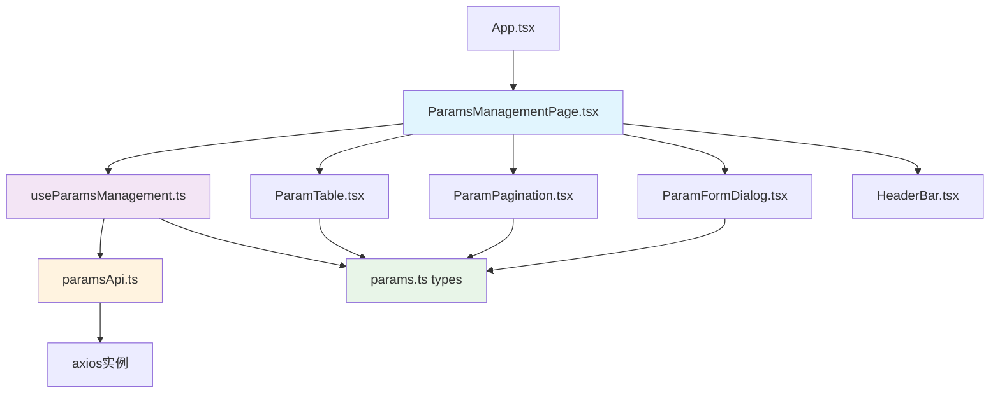
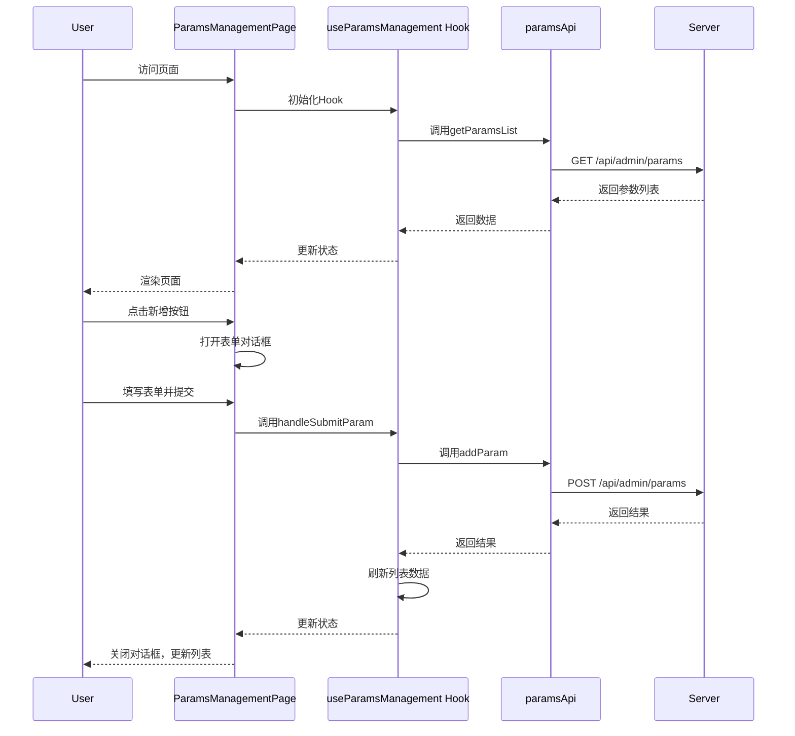

# React 参数管理页面实现文档

## 概述

本文档描述了从 Vue ParamsManagement.vue 页面复刻到 React 项目的实现方案和详细步骤。

## 功能分析

### 核心功能对比

| 功能模块 | Vue 实现 | React 实现 | 状态 |
|---------|---------|-----------|------|
| 参数列表展示 | el-table | 自定义表格组件 | ✅ |
| 搜索功能 | el-input + 事件 | Input组件 + Hook | ✅ |
| 分页控制 | 自定义分页组件 | ParamPagination组件 | ✅ |
| 新增/编辑对话框 | ParamDialog组件 | ParamFormDialog组件 | ✅ |
| 敏感参数处理 | 内置掩码逻辑 | SENSITIVE_KEYS常量 + 掩码函数 | ✅ |
| 批量选择删除 | checkbox选择 | 表格行选择 | ✅ |
| CRUD操作 | Api.admin调用 | React Query + axios | ✅ |

## 架构设计

### 文件依赖关系图



### 业务流程图



## 技术实现

### 1. 类型定义 (types/params.ts)

```typescript
// 核心数据结构
export interface ParamItem {
  id: number;
  paramCode: string;
  paramValue: string;
  remark: string;
  selected?: boolean;
  showValue?: boolean;
}

// 敏感参数检测
export const SENSITIVE_KEYS = [
  'api_key', 'access_token', 'secret', 'password'
] as const;
```

### 2. API层 (api/params.ts)

```typescript
// axios实例配置
const api = axios.create({
  baseURL: '/api',
  timeout: 10000
});

// 请求拦截器添加token
api.interceptors.request.use((config) => {
  const token = localStorage.getItem('token');
  if (token) {
    config.headers.Authorization = `Bearer ${token}`;
  }
  return config;
});
```

### 3. 业务逻辑层 (hooks/useParamsManagement.ts)

**关键功能封装：**
- 分页状态管理
- 搜索功能
- 行选择逻辑
- CRUD操作
- React Query集成

```typescript
export const useParamsManagement = () => {
  // 状态管理
  const [currentPage, setCurrentPage] = useState(1);
  const [pageSize, setPageSize] = useState<PageSize>(10);
  const [searchCode, setSearchCode] = useState('');
  const [selectedRows, setSelectedRows] = useState<number[]>([]);

  // React Query数据获取
  const { data: paramsData, isLoading, refetch } = useQuery({
    queryKey: ['params', queryParams],
    queryFn: () => paramsApi.getParamsList(queryParams)
  });
}
```

### 4. UI组件

#### ParamTable.tsx - 参数表格
- 自定义表格实现
- 敏感参数掩码显示/隐藏
- 行选择功能
- 操作按钮(编辑/删除)

#### ParamFormDialog.tsx - 表单对话框  
- React Hook Form表单验证
- 新增/编辑模式切换
- 表单提交处理

#### ParamPagination.tsx - 分页控制
- 页码跳转
- 每页条数选择
- 首页/上一页/下一页控制

## 状态管理

### 条件展示逻辑

| 条件 | 展示内容 |
|------|---------|
| `loading = true` | 显示加载中动画 |
| `params.length = 0` | 显示"暂无数据"状态 |
| `error存在` | 显示错误提示和重试按钮 |
| `isSensitiveParam(paramCode)` | 参数值显示掩码和查看/隐藏按钮 |
| `selectedRows.length > 0` | 删除按钮可点击 |
| `isAllSelected` | 全选按钮显示"取消全选" |

### 敏感参数处理

```typescript
// 敏感参数检测
const isSensitiveParam = (paramCode: string): boolean => {
  return SENSITIVE_KEYS.some(key => 
    paramCode.toLowerCase().includes(key.toLowerCase())
  );
};

// 掩码显示
const maskSensitiveValue = (value: string): string => {
  if (!value) return '';
  if (value.length <= 8) return '****';
  return value.substring(0, 4) + '****' + value.substring(value.length - 4);
};
```

## 关键差异

### Vue vs React 实现对比

| 方面 | Vue 实现 | React 实现 |
|------|---------|-----------|
| 状态管理 | data() + reactive | useState + React Query |
| 表单处理 | v-model双向绑定 | React Hook Form |
| 表格组件 | ElementUI el-table | 自定义Table组件 |
| API调用 | 传统回调方式 | React Query + async/await |
| 样式处理 | scoped CSS | Tailwind CSS类名 |
| 类型检查 | 可选TypeScript | 强制TypeScript |

### 数据流改进

1. **Vue响应式** → **React Query缓存**
2. **手动loading状态** → **自动loading状态**  
3. **手动错误处理** → **统一错误边界**
4. **命令式API** → **声明式Hook**

## 部署和使用

### 路由配置

```typescript
// App.tsx
<Route path="/params" element={
  isAuthenticated ? (
    <ParamsManagementPage />
  ) : (
    <Navigate to="/login" replace />
  )
}/>
```

### 访问地址
- 开发环境: `http://localhost:5173/params`
- 生产环境: `https://domain.com/params`

## 测试建议

### 功能测试清单
- [ ] 参数列表加载
- [ ] 搜索功能
- [ ] 分页控制
- [ ] 新增参数
- [ ] 编辑参数
- [ ] 删除单个参数
- [ ] 批量删除
- [ ] 敏感参数掩码显示
- [ ] 全选/取消全选
- [ ] 表单验证
- [ ] 错误处理

### 性能测试
- 大量数据列表渲染
- 分页性能
- 搜索响应时间

## 总结

React版本的参数管理页面成功复刻了Vue版本的所有核心功能，并在以下方面有所改进：

1. **更好的类型安全**: 完整的TypeScript支持
2. **更现代的状态管理**: React Query提供缓存和自动重新验证
3. **更好的代码组织**: Hook模式分离业务逻辑和UI逻辑
4. **更好的错误处理**: 统一的错误边界和重试机制
5. **更好的性能**: React的虚拟DOM优化和记忆化