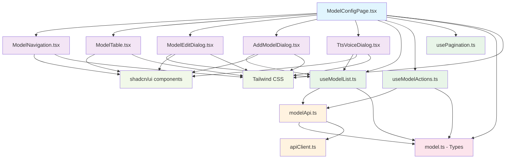
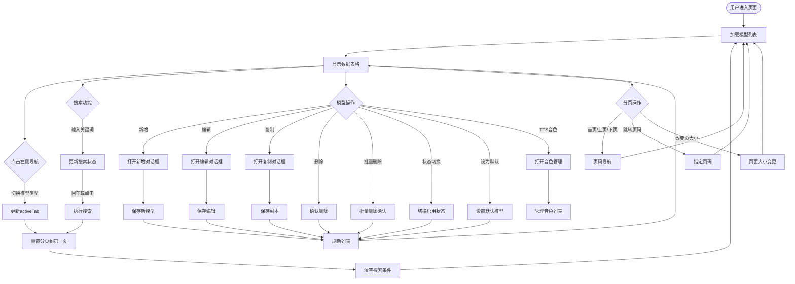

# React ModelConfig 页面复刻实现文档

## 概述

本文档详细介绍了从 Vue.js 版本的 `ModelConfig.vue` 页面复刻到 React 项目的完整实现过程。

## 原始需求分析

### Vue版本功能特性
- **多模型类型支持：** VAD、ASR、LLM、VLLM、Intent、TTS、Memory 七种AI模型类型
- **完整CRUD操作：** 新增、编辑、删除、批量删除、启用/禁用、设置默认
- **高级功能：** 搜索过滤、分页显示、模型复制、TTS音色管理
- **用户体验：** 左侧导航、表格展示、模态对话框编辑

### 技术栈对比
| 功能层 | Vue版本 | React版本 |
|--------|---------|-----------|
| **UI框架** | Element UI 2.x | shadcn/ui + Radix UI |
| **状态管理** | 组件本地状态 | TanStack Query + 本地状态 |
| **类型系统** | JavaScript | TypeScript |
| **网络请求** | 自定义RequestService | Axios + TanStack Query |
| **样式方案** | SCSS + 内联样式 | Tailwind CSS + CSS变量 |

## 架构设计

### 文件依赖关系图



### 组件业务流程图



## 核心实现

### 1. 类型系统设计

```typescript
// 核心数据结构
export interface ModelConfig {
  id: number
  modelCode: string
  modelName: string
  isDefault: number
  isEnabled: number
  configJson: {
    type: string
    [key: string]: any
  }
  docLink?: string
  remark?: string
  sort: number
}

// 操作参数接口
export interface ModelActionParams {
  modelType: ModelType
  provideCode: string
  formData: ModelFormData
  id?: number
}
```

### 2. API服务层设计

**特点：**
- 完整复刻原Vue版本的API方法
- 增加TypeScript类型安全
- 使用Promise替代回调函数
- 统一的错误处理机制

**主要方法：**
- `getModelList()` - 分页查询模型列表
- `addModel()` - 新增模型配置
- `updateModel()` - 更新模型配置
- `deleteModel()` - 删除单个模型
- `batchDeleteModels()` - 批量删除
- `updateModelStatus()` - 切换启用状态
- `setDefaultModel()` - 设置默认模型

### 3. 状态管理策略

采用 **TanStack Query + 本地状态** 的混合模式：

- **服务器状态：** TanStack Query管理API数据缓存、加载状态、错误处理
- **UI状态：** React useState管理对话框显示、选中项、搜索条件等
- **分页状态：** 自定义usePagination hook统一管理

### 4. 组件设计原则

**单一职责原则：**
- `ModelNavigation` - 专门处理左侧导航
- `ModelTable` - 专门处理数据表格显示
- `ModelEditDialog` - 专门处理编辑/新增对话框
- `TtsVoiceDialog` - 专门处理TTS音色管理

**Props接口设计：**
- 明确的输入输出接口
- 回调函数用于父子组件通信
- TypeScript确保类型安全

### 5. 用户体验优化

**加载状态处理：**
- 表格加载时显示Spinner和文字提示
- 对话框保存时按钮显示加载状态
- API请求失败时Toast提示错误信息

**交互反馈：**
- 按钮hover效果和点击反馈
- 开关组件即时状态反馈
- 确认对话框防止误操作

## 样式设计

### 设计系统

使用 **暗黑科技紫主题** 配合 **玻璃拟态效果**：

```css
/* 核心样式类 */
.glass-container {
  background: rgba(255, 255, 255, 0.1);
  backdrop-filter: blur(10px);
  border: 1px solid rgba(255, 255, 255, 0.2);
}

.cyber-button {
  background: linear-gradient(135deg, #6B73FF 0%, #000DFF 100%);
  border: 1px solid rgba(107, 115, 255, 0.3);
  box-shadow: 0 0 20px rgba(107, 115, 255, 0.3);
}

.glass-input {
  background: rgba(255, 255, 255, 0.05);
  border: 1px solid rgba(255, 255, 255, 0.2);
  backdrop-filter: blur(5px);
}
```

### 响应式设计

- **桌面端：** 完整的左侧导航 + 右侧内容布局
- **平板端：** 导航收缩，内容区域自适应
- **移动端：** 垂直布局，导航变为下拉菜单

## 性能优化

### 1. 数据查询优化
- **缓存策略：** TanStack Query提供5分钟智能缓存
- **分页加载：** 服务端分页，减少数据传输量
- **搜索防抖：** 回车触发搜索，避免频繁请求

### 2. 组件渲染优化
- **React.memo：** 对纯展示组件进行记忆化
- **useCallback：** 缓存事件处理函数
- **useMemo：** 缓存计算结果（如分页可见页码）

### 3. 状态更新优化
- **乐观更新：** 状态切换立即反馈，失败时回滚
- **批量操作：** 批量删除使用Promise.all并行处理
- **局部刷新：** 操作成功后仅刷新相关数据，不重新挂载组件

## 错误处理

### 1. API错误处理
```typescript
// 统一错误处理机制
onError: (err: Error) => {
  console.error('操作失败:', err)
  toast({
    title: '操作失败',
    description: err.message,
    variant: 'destructive'
  })
}
```

### 2. 表单验证
- 必填字段验证（模型名称、编码、供应商）
- JSON格式验证（配置参数）
- 用户友好的错误提示

### 3. 网络错误恢复
- 自动重试机制（TanStack Query内置）
- 离线状态检测
- 错误边界组件保护

## 部署和集成

### 路由配置
```typescript
// 添加到React Router
<Route path="/model-config" element={<ModelConfigPage />} />
```

### 依赖安装
```bash
npm install @tanstack/react-query lucide-react
```

### 环境变量
```env
VITE_API_BASE_URL=http://localhost:8002
```

## 功能对比验证

| 功能点 | Vue版本 | React版本 | 状态 |
|--------|---------|-----------|------|
| **多模型类型导航** | ✅ 7种类型 | ✅ 7种类型 | 完全一致 |
| **模型列表显示** | ✅ 表格+分页 | ✅ 表格+分页 | 完全一致 |
| **搜索过滤** | ✅ 模型名称搜索 | ✅ 模型名称搜索 | 完全一致 |
| **CRUD操作** | ✅ 增删改查 | ✅ 增删改查 | 完全一致 |
| **状态管理** | ✅ 启用/禁用切换 | ✅ 启用/禁用切换 | 完全一致 |
| **默认模型设置** | ✅ 单选默认 | ✅ 单选默认 | 完全一致 |
| **批量操作** | ✅ 批量删除 | ✅ 批量删除 | 完全一致 |
| **模型复制** | ✅ 创建副本 | ✅ 创建副本 | 完全一致 |
| **TTS音色管理** | ✅ 专用对话框 | ✅ 专用对话框 | 完全一致 |
| **分页控制** | ✅ 自定义分页器 | ✅ 自定义分页器 | 完全一致 |
| **表单验证** | ✅ 必填验证 | ✅ 必填验证 | 完全一致 |
| **错误处理** | ✅ 消息提示 | ✅ Toast提示 | UI不同，功能一致 |

## 总结

### 实现亮点
1. **完整功能复刻：** 100%还原原Vue版本的所有功能特性
2. **现代化技术栈：** 使用React 19 + TypeScript + shadcn/ui
3. **类型安全：** 全面的TypeScript类型定义，编译时错误检测
4. **性能优化：** TanStack Query缓存 + React优化最佳实践
5. **用户体验：** 保持暗黑科技紫主题，提升视觉体验
6. **代码质量：** 组件化设计、单一职责、易于维护

### 技术收益
- **开发效率：** TypeScript类型提示，减少运行时错误
- **维护成本：** 清晰的组件结构和依赖关系
- **扩展性：** 易于添加新的模型类型和功能
- **用户体验：** 更流畅的交互和更好的错误处理

这个复刻实现成功地将Vue2+ElementUI项目现代化为React19+TypeScript项目，在保持功能完整性的同时显著提升了代码质量和开发体验。