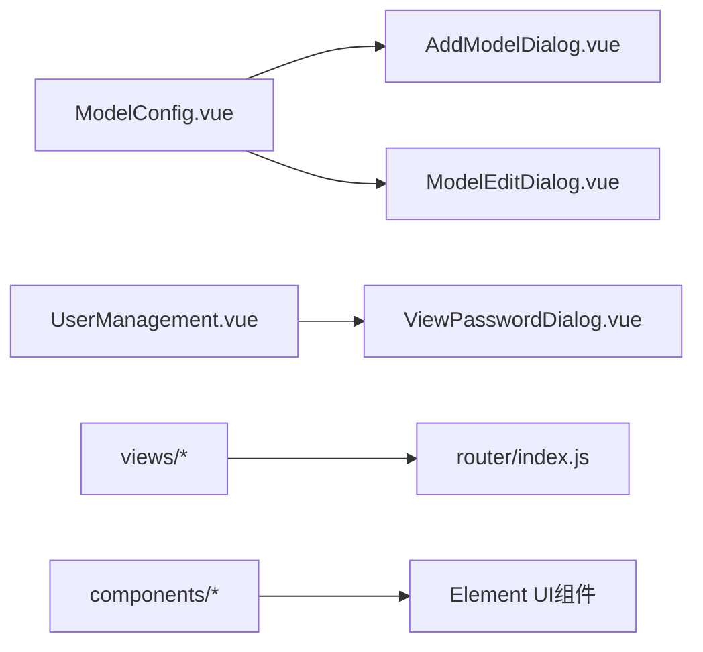
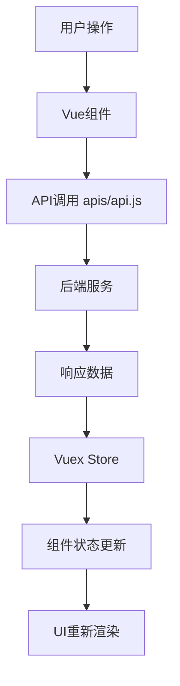

# 小智ESP32服务端管理后台

## 项目概述

这是一个基于Vue 2的Web管理后台项目，用于管理小智ESP32服务端的各种功能模块，包括用户管理、设备管理、模型配置、参数管理等。

## 技术栈

### 核心框架
- **Vue.js**: 2.6.14 (渐进式JavaScript框架)
- **Vue Router**: 3.6.5 (前端路由管理)
- **Vuex**: 3.6.2 (状态管理)
- **Element UI**: 2.15.14 (UI组件库)

### 构建工具
- **Vue CLI**: 5.0.9 (Vue项目脚手架)
- **Webpack**: 5.x (模块打包工具)
- **Babel**: 转译ES6+代码
- **Sass**: CSS预处理器

### 其他依赖
- **axios/vue-axios**: HTTP请求库
- **flyio**: 轻量级HTTP请求库
- **opus-decoder/opus-recorder**: 音频处理
- **normalize.css**: CSS样式标准化
- **core-js**: JavaScript标准库polyfill

## 项目架构

### 目录结构
```
src/
├── components/          # 可复用组件
│   ├── AddModelDialog.vue      # 添加模型对话框
│   ├── ModelEditDialog.vue     # 编辑模型对话框
│   └── ViewPasswordDialog.vue  # 密码查看对话框
├── views/              # 页面组件
│   ├── login.vue              # 登录页
│   ├── home.vue               # 首页
│   ├── DeviceManagement.vue   # 设备管理
│   ├── UserManagement.vue     # 用户管理
│   ├── ModelConfig.vue        # 模型配置
│   ├── ParamsManagement.vue   # 参数管理
│   └── ...
├── router/             # 路由配置
│   └── index.js
├── store/              # Vuex状态管理
│   └── index.js
├── utils/              # 工具函数
│   └── index.js
├── styles/             # 样式文件
│   ├── ironman-theme.scss    # 钢铁侠红主题样式系统
│   └── ...
├── apis/               # API接口
│   └── api.js
└── main.js             # 应用入口
```

## 钢铁侠红主题设计系统

### 主题概述
项目采用钢铁侠机甲风格的深色主题设计，以科技感和未来感为核心设计理念，营造高端、专业的用户界面体验。

### 色彩系统

#### 机甲红色调色板
```scss
$armor-red-primary: #DC143C;    // 深红主色 - 主要按钮、边框
$armor-red-light: #FF4500;      // 橙红亮色 - 高亮、hover状态
$armor-red-dark: #B22222;       // 暗红色 - 阴影、渐变终点
$armor-red-glow: #FF0000;       // 发光红色 - 特效发光
```

#### 金色点缀系统
```scss
$gold-primary: #FFD700;         // 主金色 - 重要文本、图标
$gold-dark: #FFA500;            // 暗金色 - 次要元素
$gold-light: #FFEC8B;           // 浅金色 - 细节装饰
```

#### 深色背景体系
```scss
$bg-primary: #0a0a0a;           // 主背景 - 页面底色
$bg-secondary: #1a1a1a;         // 次背景 - 卡片背景
$bg-tertiary: #2a2a2a;          // 三级背景 - 面板背景
$bg-card: rgba(26, 26, 26, 0.85); // 卡片背景 - 半透明玻璃效果
```

#### 文本色彩层级
```scss
$text-primary: #ffffff;         // 主文本 - 标题、重要内容
$text-secondary: #b0b0b0;       // 次要文本 - 描述、辅助信息
$text-accent: $gold-primary;    // 强调文本 - 链接、特殊标记
$text-danger: $armor-red-light; // 错误文本 - 警告、错误提示
```

### 发光效果系统

#### 红色发光变体
```scss
$glow-red: 0 0 20px $armor-red-glow;                    // 标准红色发光
$glow-red-intense: 0 0 30px $armor-red-glow, 0 0 40px $armor-red-primary; // 强烈发光
$glow-red-soft: 0 0 10px rgba(220, 20, 60, 0.5);      // 柔和发光
```

#### 金色发光变体
```scss
$glow-gold: 0 0 15px $gold-primary;                     // 标准金色发光
$glow-gold-intense: 0 0 25px $gold-primary, 0 0 35px $gold-dark; // 强烈发光
$glow-gold-soft: 0 0 8px rgba(255, 215, 0, 0.3);      // 柔和发光
```

### 渐变系统

#### 机甲红渐变
```scss
$gradient-armor-red: linear-gradient(135deg, $armor-red-primary 0%, $armor-red-dark 100%);
$gradient-armor-red-vertical: linear-gradient(180deg, $armor-red-light 0%, $armor-red-primary 50%, $armor-red-dark 100%);
```

#### 背景渐变
```scss
$gradient-bg-dark: linear-gradient(135deg, $bg-primary 0%, $bg-secondary 50%, $bg-tertiary 100%);
$gradient-bg-radial: radial-gradient(circle at center, rgba(220, 20, 60, 0.1) 0%, transparent 70%);
```

#### 玻璃效果
```scss
$gradient-glass: linear-gradient(135deg, rgba(255, 255, 255, 0.1) 0%, rgba(255, 255, 255, 0.05) 100%);
```

### 动画系统

#### 发光脉冲动画
```scss
@keyframes glow-pulse-red {
  0%, 100% { box-shadow: $glow-red-soft; }
  50% { box-shadow: $glow-red; }
}

@keyframes glow-pulse-gold {
  0%, 100% { box-shadow: $glow-gold-soft; }
  50% { box-shadow: $glow-gold; }
}
```

#### 科技扫描线动画
```scss
@keyframes scan-line {
  0% { transform: translateX(-100%); }
  100% { transform: translateX(100vw); }
}
```

#### 能量充电动画
```scss
@keyframes energy-charge {
  0% { width: 0%; }
  100% { width: 100%; }
}
```

### 通用组件样式

#### 玻璃效果卡片 (.glass-card)
- **背景**: 半透明深色背景配合毛玻璃效果
- **边框**: 机甲红色细边框，hover时增强
- **阴影**: 红色发光阴影
- **顶部装饰**: 金色细线装饰

#### 发光按钮 (.glow-button)
- **背景**: 机甲红渐变背景
- **边框**: 双像素红色边框
- **交互**: hover时发光效果和上升动画
- **扫光效果**: 鼠标悬停时的光带扫过效果

#### 机甲输入框 (.iron-input)
- **背景**: 深色半透明背景
- **边框**: 金色边框，焦点时发光
- **占位符**: 斜体次要文本色
- **验证状态**: 错误时红色发光边框

#### 科技线条装饰 (.tech-lines)
- **扫描线**: 金色渐变扫描线动画
- **位置**: 绝对定位，不干扰内容交互
- **动画**: 多条扫描线循环动画，增加科技感

#### 能量条 (.energy-bar)
- **容器**: 深色背景，红色边框
- **进度条**: 红色渐变，配合发光效果
- **动画**: 能量充电动画效果

### 主题应用指南

#### 页面容器 (.ironman-container)
```scss
.ironman-container {
  background: $gradient-bg-dark;
  color: $text-primary;
  min-height: 100vh;
  position: relative;
  overflow: hidden;
  
  &::before {
    content: '';
    position: absolute;
    top: 0; left: 0; right: 0; bottom: 0;
    background: $gradient-bg-radial;
    pointer-events: none;
    z-index: 1;
  }
}
```

#### 响应式适配
- **移动端**: 减少发光效果强度，优化性能
- **小屏幕**: 进一步简化装饰效果
- **触摸设备**: 调整交互反馈

### 设计原则

1. **科技未来感**: 发光效果、扫描线、能量条等元素营造科技氛围
2. **层次分明**: 使用渐变和发光效果建立视觉层次
3. **交互反馈**: 丰富的hover、focus等交互动画
4. **性能优化**: 移动端适当减少动画效果
5. **可访问性**: 保持足够的对比度和文字可读性

### 使用方式
```scss
// 引入主题文件
@import '@/styles/ironman-theme.scss';

// 在组件中使用主题类
<div class="ironman-container">
  <div class="glass-card">
    <button class="glow-button">操作按钮</button>
    <input class="iron-input" placeholder="输入内容">
  </div>
  <div class="tech-lines"></div>
</div>
```

### 路由架构
```mermaid
graph TD
    A[/] --> B[login.vue - 登录页]
    C[/home] --> D[home.vue - 首页]
    E[/device-management] --> F[DeviceManagement.vue - 设备管理]
    G[/user-management] --> H[UserManagement.vue - 用户管理] 
    I[/model-config] --> J[ModelConfig.vue - 模型配置]
    K[/params-management] --> L[ParamsManagement.vue - 参数管理]
    M[/role-config] --> N[roleConfig.vue - 角色配置]
    O[/voice-print] --> P[VoicePrint.vue - 声纹识别]
```

### 组件依赖关系


### 数据流图


## 开发命令

### 基础命令
```bash
# 安装依赖
npm install

# 启动开发服务器
npm run serve

# 构建生产版本
npm run build

# 分析构建产物
npm run analyze
```

### 项目配置
- 开发服务器端口: 自动分配
- 构建输出目录: `dist/`
- 公共路径: 通过环境变量 `VUE_APP_PUBLIC_PATH` 配置

## 主要功能模块

### 1. 身份验证系统
- **路由守卫**: 保护需要登录的页面
- **Token管理**: localStorage存储用户凭证
- **登录页面**: 用户身份验证入口

### 2. 模型管理
- **模型配置**: 配置AI模型参数
- **供应器管理**: 管理模型供应商
- **动态表单**: 根据供应商动态生成配置字段

### 3. 设备管理
- **设备状态监控**: 实时监控ESP32设备状态
- **设备配置**: 管理设备参数和配置

### 4. 用户管理
- **用户CRUD**: 用户的增删改查
- **权限管理**: 用户角色和权限控制
- **密码管理**: 安全的密码生成和查看

### 5. 参数管理
- **系统参数**: 全局系统配置参数
- **运行时配置**: 动态运行参数调整

## 编译配置说明

### Vue版本兼容性
本项目使用**Vue 2.6.14**，请确保：
- 使用Vue 2语法（template v-for key放在实际元素上）
- Element UI版本匹配Vue 2
- vue-loader版本为15.x（非17.x）

### 常见编译问题解决方案

#### 1. Template v-for key位置错误
**问题**: `<template> cannot be keyed. Place the key on real elements instead.`

**解决方案**:
```vue
<!-- ❌ Vue3语法（错误） -->
<template v-for="item in items" :key="item.id">
  <div>{{ item.name }}</div>
</template>

<!-- ✅ Vue2语法（正确） -->
<template v-for="item in items">
  <div :key="item.id">{{ item.name }}</div>
</template>
```

#### 2. v-model prop错误  
**问题**: `v-model cannot be used on a prop`

**解决方案**:
```vue
<!-- ❌ 错误用法 -->
<el-input v-model="propsValue" />

<!-- ✅ 正确用法 -->
<el-input :value="propsValue" @input="$emit('update:propsValue', $event)" />
```

#### 3. 模块依赖解析错误
**解决方案**:
```bash
# 清理缓存
rm -rf node_modules/.cache
rm -rf .webpack_cache
npm run serve
```

### Webpack配置特性
- **CDN资源**: 生产环境使用CDN加载外部库
- **Service Worker**: PWA支持和离线缓存
- **代码分割**: 自动分割vendor和业务代码
- **压缩优化**: Terser压缩和Gzip压缩

## 开发规范

### 组件命名规范
- 页面组件: PascalCase (如: `UserManagement.vue`)
- 通用组件: PascalCase + 功能描述 (如: `AddModelDialog.vue`)

### 代码风格
- 使用ES6+语法
- 组件使用单文件组件(.vue)格式
- 样式使用Sass预处理器
- 遵循Vue.js官方风格指南

### API接口规范
```javascript
// apis/api.js 统一管理接口
export default {
  user: {
    login: (data) => request.post('/api/login', data),
    getUserList: () => request.get('/api/users')
  },
  model: {
    getModelProviders: (type, callback) => { /* ... */ }
  }
}
```

## 部署说明

### 构建配置
```javascript
// vue.config.js 主要配置
module.exports = {
  publicPath: process.env.VUE_APP_PUBLIC_PATH || '/',
  outputDir: 'dist',
  productionSourceMap: false,
  // CDN资源配置
  externals: {
    vue: 'Vue',
    'element-ui': 'ELEMENT'
  }
}
```

### 环境变量
- `VUE_APP_PUBLIC_PATH`: 部署路径前缀
- `NODE_ENV`: 运行环境 (development/production)

### 生产部署检查清单
- [ ] 构建成功无错误
- [ ] 静态资源路径正确  
- [ ] CDN资源可访问
- [ ] Service Worker配置正确
- [ ] 路由配置匹配服务器配置

## 故障排除

### 常见问题

**Q: 开发服务器启动失败**
A: 检查Node.js版本，建议使用Node 14+

**Q: 组件样式丢失**  
A: 检查Sass loader配置和样式文件导入

**Q: 路由404错误**
A: 检查服务器配置，确保支持History模式

**Q: API请求CORS错误**
A: 配置开发服务器代理或后端CORS设置

### 性能优化建议
1. **懒加载**: 路由组件使用动态import
2. **CDN加速**: 静态资源使用CDN
3. **缓存策略**: 合理设置Service Worker缓存
4. **代码分割**: 避免单个bundle过大

---

## 维护人员

此文档由 Claude Code AI助手生成和维护。

最后更新时间: 2025-09-06
项目版本: 0.1.0